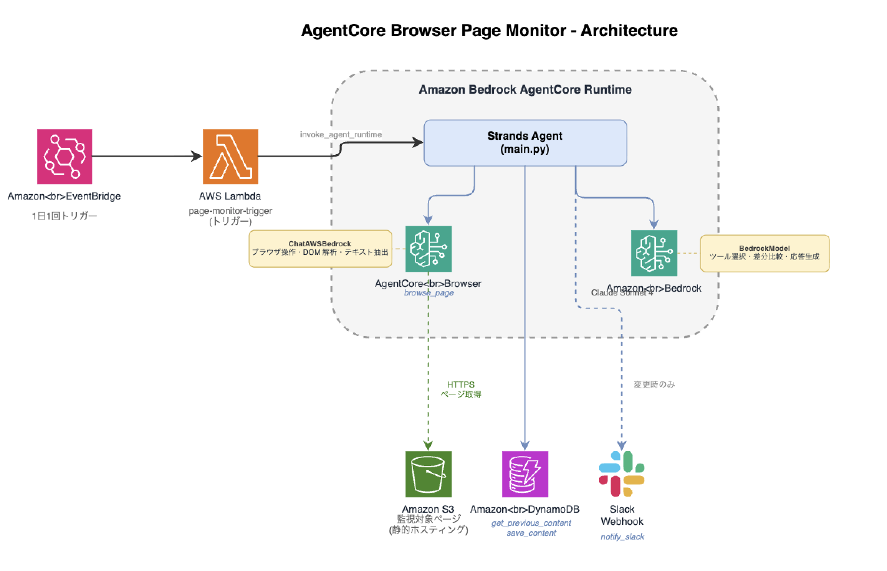

# AgentCore Browser ページ監視システム

Amazon Bedrock AgentCore Browser を使った Web ページ変更検知システムです。Web ページを自動的に監視し、前回の内容と比較して変更を検知すると Slack に通知します。

[English README](README.md)

## アーキテクチャ




## 構成

| コンポーネント | 説明 |
|--------------|------|
| `src/main.py` | 4つのツールを持つエージェント: browse_page, get_previous_content, save_content, notify_slack |
| `cdk/` | 周辺インフラ（Lambda, EventBridge, DynamoDB） |
| `target-page/` | 監視対象のサンプル料金ページ（S3 静的ホスティング） |

## 前提条件

- AWS CLI が ap-northeast-1 で設定済み
- [AgentCore CLI](https://docs.aws.amazon.com/bedrock-agentcore/)（`agentcore`）
- Node.js / pnpm
- Slack ワークスペースの管理権限

## セットアップ

### 1. Slack Webhook の準備

1. [Slack API](https://api.slack.com/apps) で新しい App を作成
2. Incoming Webhooks を有効化
3. 通知先チャンネル（例: `#page-monitor`）を選択して Webhook URL を取得
4. 動作確認:
   ```bash
   curl -X POST -H 'Content-type: application/json' \
     --data '{"text":"テスト通知"}' \
     https://hooks.slack.com/services/TXXXXX/BXXXXX/XXXXXXXX
   ```

### 2. 監視対象ページを S3 にデプロイ

```bash
cd target-page
./deploy.sh <バケット名>
```

HTTPS の URL をメモ（HTTP URL は AgentCore Browser でブロックされます）:
```
https://<バケット名>.s3.ap-northeast-1.amazonaws.com/index.html
```

### 3. AgentCore プロジェクトの作成とエージェントコードの適用

```bash
# プロジェクト作成（pagemonitor/ ディレクトリが生成される）
agentcore create --name pagemonitor --defaults --build CodeZip --output-dir .
cd pagemonitor

# 生成されたコードをリポジトリのエージェントコードで上書き
cp -f ../src/main.py app/pagemonitor/main.py
cp -f ../src/model/load.py app/pagemonitor/model/load.py
cp -f ../src/model/__init__.py app/pagemonitor/model/__init__.py
cp -f ../src/pyproject.toml app/pagemonitor/pyproject.toml

# 不要な生成ファイルを削除
rm -rf app/pagemonitor/mcp_client
```

### 4. 環境変数の設定

`agentcore/agentcore.json` の runtimes 定義に `envVars` を追加。また `"name"` を `"pagemonitor"` から `"agent"` に変更:

```json
{
  "runtimes": [
    {
      "name": "agent",
      ...
      "envVars": [
        {"name": "DYNAMODB_TABLE", "value": "PageMonitorState"},
        {"name": "AWS_REGION", "value": "ap-northeast-1"},
        {"name": "LLM_MODEL_ID", "value": "apac.anthropic.claude-sonnet-4-20250514-v1:0"},
        {"name": "SLACK_WEBHOOK_URL", "value": "<Slack Webhook URL>"},
        {"name": "MONITOR_URL", "value": "https://<バケット名>.s3.ap-northeast-1.amazonaws.com/index.html"}
      ]
    }
  ]
}
```

### 5. AgentCore エージェントのデプロイ

```bash
agentcore deploy
agentcore status  # Runtime ARN をメモ
```

### 6. IAM 権限の追加

`agentcore deploy` で作成される実行ロールに追加の権限が必要です:

```bash
# ロール名を確認
aws iam list-roles --query "Roles[?contains(RoleName, 'pagemonitor')].RoleName" --output text

# AgentCore Browser の権限を追加
aws iam put-role-policy \
  --role-name "<ロール名>" \
  --policy-name "AgentCoreBrowserAccess" \
  --policy-document '{
    "Version": "2012-10-17",
    "Statement": [{"Effect": "Allow", "Action": "bedrock-agentcore:*", "Resource": "*"}]
  }'

# DynamoDB の権限を追加
aws iam put-role-policy \
  --role-name "<ロール名>" \
  --policy-name "DynamoDBPageMonitorAccess" \
  --policy-document '{
    "Version": "2012-10-17",
    "Statement": [{"Effect": "Allow", "Action": ["dynamodb:GetItem", "dynamodb:PutItem"], "Resource": "arn:aws:dynamodb:ap-northeast-1:<アカウントID>:table/PageMonitorState"}]
  }'
```

### 7. 周辺インフラのデプロイ（CDK）

```bash
cd ../cdk
pnpm install
pnpm cdk bootstrap  # 初回のみ
pnpm cdk deploy --parameters AgentCoreRuntimeArn=<Runtime ARN>
```

## 動作確認

### 初回実行

1. AWS コンソール -> Lambda -> `page-monitor-trigger`
2. 「テスト」タブで `{}` をテストイベントとして実行
3. 確認:
   - Lambda が正常終了すること
   - DynamoDB `PageMonitorState` にレコードが作成されること
   - Slack 通知が来ないこと（初回のため）

### 変更検知テスト

1. `target-page/index.html` を編集（例: 料金を変更）
2. S3 に再デプロイ: `cd target-page && ./deploy.sh <バケット名>`
3. Lambda を再実行
4. 確認:
   - Slack に変更検知通知が届くこと
   - 変更内容の要約が含まれていること

### CLI での動作確認

```bash
agentcore invoke '{}'
```

## 技術的な注意事項

- **HTTPS 必須**: AgentCore Browser は HTTP URL をブロックします（`net::ERR_BLOCKED_BY_CLIENT`）。`https://<バケット名>.s3.<リージョン>.amazonaws.com/index.html` 形式を使用してください。
- **LLM クラス**: `langchain_aws.ChatBedrockConverse` ではなく `browser_use.llm.aws.chat_bedrock.ChatAWSBedrock` を使用してください（pydantic の `extra='forbid'` 制約により browser-use と非互換）。
- **browser-use バージョン**: 互換性のため `0.12.6` に固定しています。

## クリーンアップ

```bash
# 周辺リソースの削除（Lambda, EventBridge, DynamoDB）
cd cdk && pnpm cdk destroy

# AgentCore Runtime の削除
cd pagemonitor/agentcore/cdk && npm install && npx cdk destroy

# S3 バケットの削除
aws s3 rb s3://<バケット名> --force
```

## 参考

- [Amazon Bedrock AgentCore Browser サンプル (DevelopersIO)](https://dev.classmethod.jp/articles/amazon-bedrock-agentcore-agentcore-browser-sample/)
